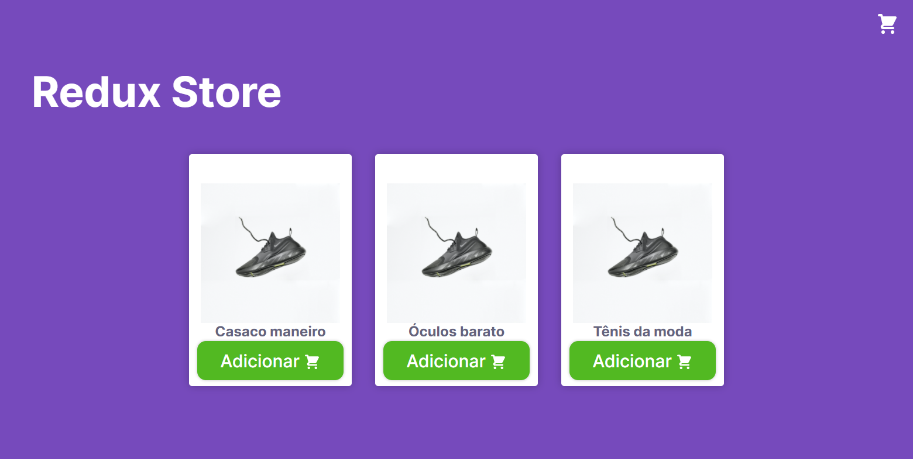
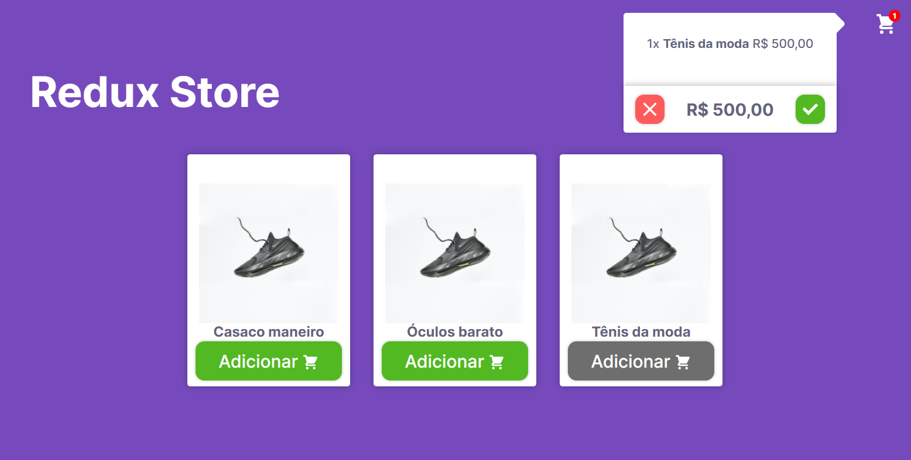
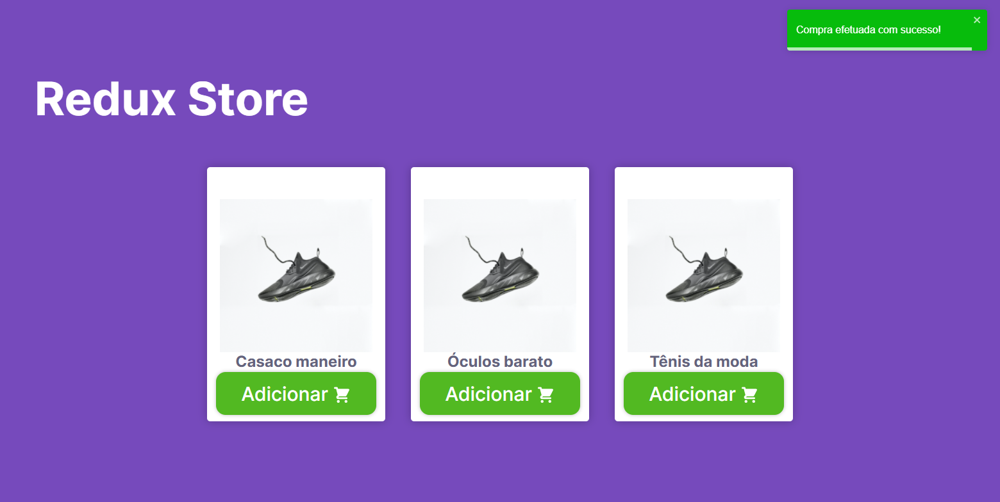
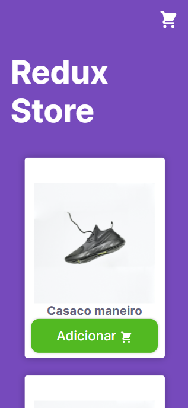
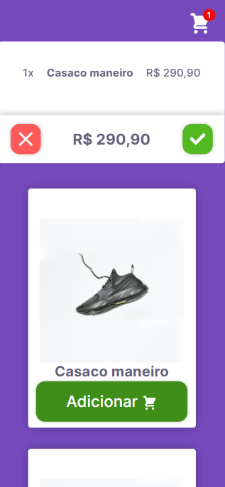
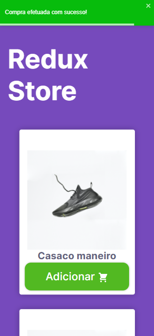

<p align="center">
  <h1 style="
    color:#764abc;
    font-weight:bold"
  >
    Redux Store
  </h1>
</p>

# Sobre o projeto
  Redux Store é um projeto de carrinho desenvolvido para testar as funcionalidades do [Redux](https://redux.js.org).

# Layout web
<p>
    
    
    
</p>

# Layout mobile
<p align="center">
  
  
  
</p>

# 🛠 Tecnologias
As seguintes ferramentas foram usadas na construção do projeto:

### front-end

- [axios](https://www.npmjs.com/package/axios)
- [immer](https://www.npmjs.com/package/immer)
- [typescript](https://www.typescriptlang.org)
- [polished](https://www.npmjs.com/package/polished)
- [framer-motion](https://www.npmjs.com/package/framer-motion)
- [redux](https://redux.js.org)
- [redux-saga](https://redux-saga.js.org)
- [react-icons](https://react-icons.github.io/react-icons/)
- [react-toastify](https://www.npmjs.com/package/react-toastify)
- [styled-components](https://styled-components.com)

### back-end
- [json-server](https://github.com/typicode/json-server)


# Back-End
O back-end foi construído em usando o json-server seguindo os seguintes caminhos:
  * /products - lista os produtos cadastrados
  * /stock - lsita a quantidade de produtos no stock

# 🚀 Como executar o projeto

## Pré-requisitos
Antes de começar, você vai precisar ter instalado em sua máquina as seguintes ferramentas:

 * [Git](https://git-scm.com)
 * [Node.js](https://nodejs.org)
 * [VSCode](https://code.visualstudio.com) ou outro editor de codigos

## 🧭 Rodando a aplicação


```bash
# Clone este repositório
$ git clone https://github.com/Leandro-Goncalves/redux-store

# Acesse a pasta do projeto no seu terminal/cmd
$ cd redux-store

# Instale as dependências
$ npm install
# ou
$ yarn

# Execute o json server
$ yarn server
# ou
$ npm run start

# Execute a aplicação em modo de desenvolvimento
$ npm run start
# ou
$ yarn start

# A aplicação será aberta na porta:3000 - acesse http://localhost:3000
```
---

# Author
Feito com ❤️ por Leandro Gonçalves [Entre em contato!](mailto:leandrogoncalvesprofissional@hotmail.com)

<a href="https://github.com/Leandro-Goncalves/">
  
 <br />
 <sub><b>Leandro Gonçalves</b></sub></a>

---